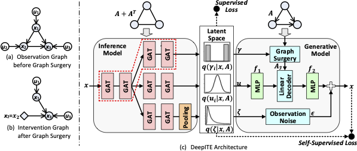

# DeepITE: Designing Variational Graph Autoencoders for Intervention Target Estimation  [NeurIPS 2024]



## Abstract

Intervention Target Estimation (ITE) is vital for both understanding and decision-making in complex systems, yet it remains underexplored. Current ITE methods are hampered by their inability to learn from distinct intervention instances collaboratively and to incorporate rich insights from labeled data, which leads to inefficiencies such as the need for re-estimation of intervention targets with minor data changes or alterations in causal graphs. In this paper, we propose DeepITE, an innovative deep learning framework designed around a variational graph autoencoder. DeepITE can concurrently learn from both unlabeled and labeled data with different intervention targets and causal graphs, harnessing correlated information in a self or semi-supervised manner. The model's inference capabilities allow for the immediate identification of intervention targets on unseen samples and novel causal graphs, circumventing the need for retraining. Our extensive testing confirms that DeepITE not only surpasses 13 baseline methods in the Recall@k metric but also demonstrates expeditious inference times, particularly on large graphs. Moreover, incorporating a modest fraction of labeled data (5-10\%) substantially enhances DeepITE's performance, further solidifying its practical applicability.

## Dataset


We preprocessed two synthetic and two real world datasets from widely-cited works that contain diverse characteristics in terms of their application domains and temporal statistics:
- Synthetic: Synthetic data were generated from `VACA` (https://github.com/psanch21/VACA) and `CIRCA` (https://github.com/NetManAIOps/CIRCA)
- Protein: Provided in `Causal protein-signaling networks derived from multiparameter single-cell data` (https://www.science.org/doi/abs/10.1126/science.1105809).
- SPGC: Provided in `ICASSP-SPGC 2022: Root cause analysis for wireless network fault localization` (https://ieeexplore.ieee.org/abstract/document/9746687).

## Quick Start

We provide an end-to-end example for users to run our scrpits.


### Installation

First of all, we can install the package either by using pip.

To install the latest stable version:
```bash
pip install -r requirements.txt
```

### Setup

We need to put the datasets in a specific directory before running a model and the datasets should follow a certain format. Before start training, we need to set up the config file for the pipeline. We provide a preset config file in our project.

```bash
    config
     |______template.json
```

```json
    "dataset": "Synthetic",
    "train_dataset_path": "dataset/Synthetic",
    "valid_dataset_path": null,
    "model_path": null,
    "save_path": "saved_models/",
```

Then we start the training by simply running the script 

```bash
python scripts/train.py --c config/template.json
```


## License

This project is licensed under the [Apache License (Version 2.0)](https://github.com/alibaba/EasyNLP/blob/master/LICENSE). This toolkit also contains some code modified from other repos under other open-source licenses. See the [NOTICE](https://github.com/ant-research/EasyTPP/blob/master/NOTICE) file for more information.

## Citation

<span id='citation'/>

If you find `DeepITE` useful for your research or development, please cite our paper [Coming soon]


